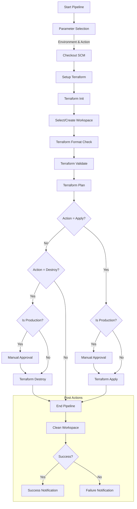

#Let me explain the key stages in this flow:

**1. Initial Stages:**
- Pipeline starts with parameter selection (Environment & Action)
- Checks out code from SCM
- Sets up Terraform environment

**2. Terraform Initialization:**
- Initializes Terraform
- Selects or creates workspace based on environment
- Performs format check and validation

**3. Action Flow:**
- If Action = 'Apply':
  - For production, requires manual approval
  - Executes Terraform apply

- If Action = 'Destroy':
  - For production, requires manual approval
  - Executes Terraform destroy

**4. Post Actions:**
- Cleans workspace
- Sends success/failure notifications

**This flowchart helps visualize:**
- Decision points in the pipeline
- Security measures (approval steps)
- Different paths based on environment
- Complete pipeline lifecycle
---

